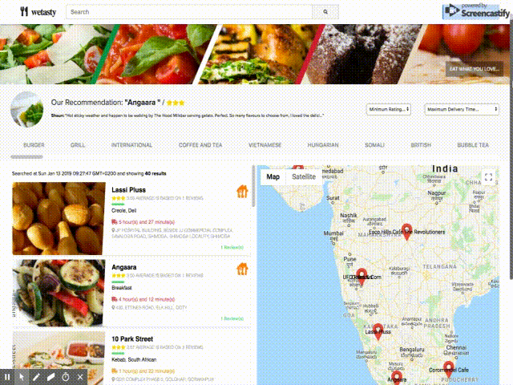

# wetasty / Frontend

Frontend application based on React and node.js.

- View the app <a href="https://wetasty.herokuapp.com" target="_blank">in Heroku</a>

Note: This project was bootstrapped with [Create React App](https://github.com/facebook/create-react-app).

 

### Prerequisites
* yarn (a package manager)
---
### Initialization tasks
    yarn install
---
### Server start
    yarn start
---

### Details about packages used
 
- HTTP 
    - [axios](https://www.npmjs.com/package/axios) (Promise based HTTP client for the browser and node.js.)
- Rendering/UI
    - [classnames](https://www.npmjs.com/package/classnames) (A simple utility for conditionally joining classNames together)
    - [lodash](https://www.npmjs.com/package/lodash) (utility library, used mostly for debounce and sample)
    - [moment-timezone](https://www.npmjs.com/package/moment-timezone) (Parse and display dates in any timezone)
    - [react-moment](https://www.npmjs.com/package/react-moment) (Moment's date library)
    - [react-google-maps](https://github.com/tomchentw/react-google-maps) (Google Maps integration component)
- Styling
    - [fontawesome-free](https://www.npmjs.com/package/@fortawesome/fontawesome-free) (Font awesome, icons use)
    - [node-sass](https://www.npmjs.com/package/node-sass) (sass stylesheet preprocessor)
- State management
    - [react-redux](https://github.com/reduxjs/react-redux) (manage appication's state using a predictable state container, also using [redux](https://github.com/reduxjs/redux))
    - [redux-form](https://github.com/erikras/redux-form) (maintaining form's state)
    - [redux-thunk](https://github.com/reduxjs/redux-thunk) (Thunk middleware for Redux)
   
### Screenshots

---
### Testing
No tests
